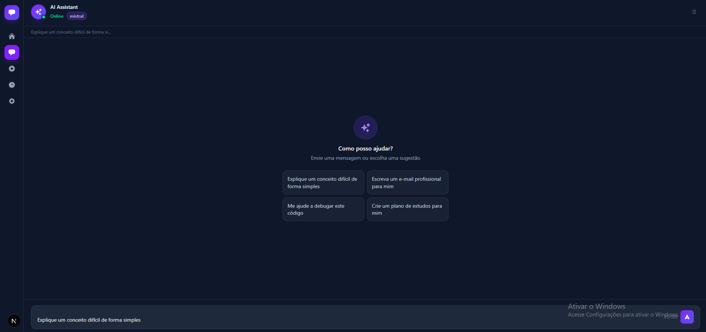
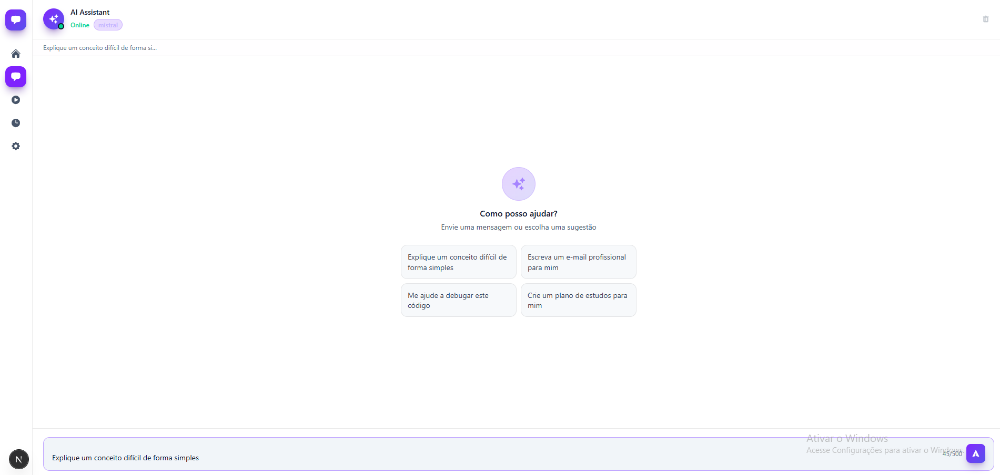
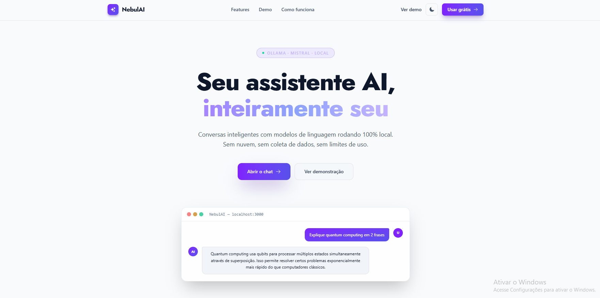
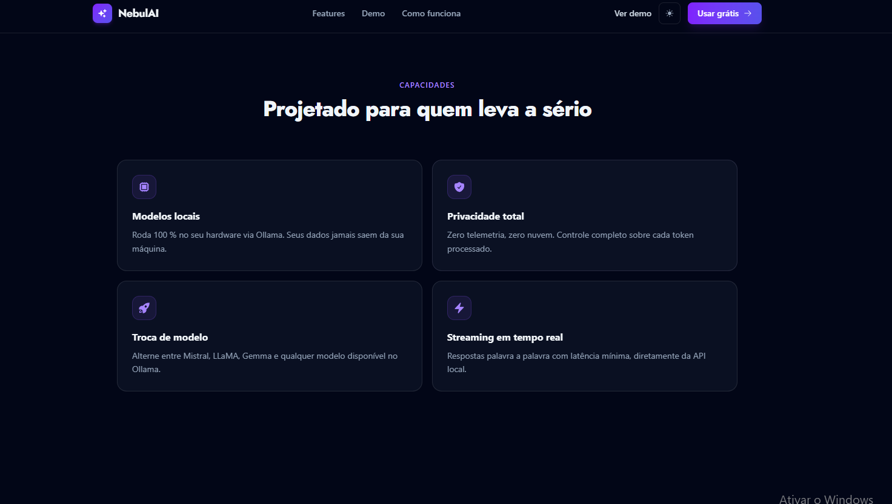
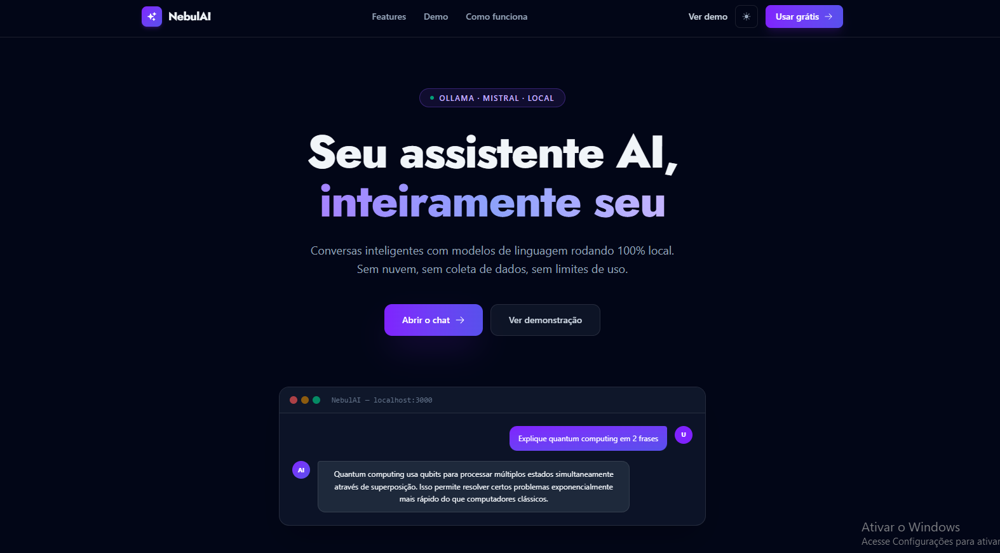

# Nebula Chat

[](../../actions/workflows/ci.yml)
[](#)
[](#)
[](#)
[](#)
[](#)
[](#license)

A dark-themed conversational chatbot powered by a local [Ollama](https://ollama.ai/) instance. Tokens stream in real time, the model remembers previous turns, and the whole UI stays fully accessible.

---

## Screenshots

**Chat interface — dark & light**

<div align="center">
  <table>
    <tr>
      <td></td>
      <td></td>
    </tr>
  </table>
</div>

**Landing page & features**

<div align="center">
  <table>
    <tr>
      <td></td>
      <td></td>
    </tr>
    <tr>
      <td></td>
      <td></td>
    </tr>
  </table>
</div>

---

## Features

| Area                     | Details                                                                                        |
| ------------------------ | ---------------------------------------------------------------------------------------------- |
| **Streaming**            | Tokens appear as they are generated — animated cursor during generation                        |
| **Conversation context** | Last 10 turns sent to the model on every request                                               |
| **Cancel mid-stream**    | Stop button aborts the in-flight request via `AbortController`                                 |
| **Model picker**         | Switch between any model installed in Ollama at runtime                                        |
| **Session history**      | Past conversations saved to `localStorage` (up to 50 sessions)                                 |
| **Dark "Nebula" theme**  | Violet/indigo accent on `slate-950` base; light mode toggle                                    |
| **Security**             | SSRF prevention, in-memory rate limiting (20 req/min per IP), Zod validation, security headers |
| **Error boundary**       | Full-screen fallback UI on unexpected crashes                                                  |
| **CI**                   | GitHub Actions — `tsc`, ESLint, Vitest on every push/PR                                        |

---

## Tech Stack

| Layer      | Technology                             |
| ---------- | -------------------------------------- |
| Framework  | Next.js 15 (`pages/` router)           |
| Language   | TypeScript 5 (strict)                  |
| Styling    | TailwindCSS v4 + Flowbite React        |
| State      | Zustand 5 with `persist` middleware    |
| AI backend | Ollama local — default model `mistral` |
| Testing    | Vitest + React Testing Library + MSW   |

---

## Prerequisites

- **Node.js 20+**
- **[Ollama](https://ollama.ai/)** running locally on port `11434`
- At least one model pulled, e.g.:

```bash
ollama pull mistral
```

---

## Installation

```bash
# 1. Clone the repository
git clone https://github.com/your-username/chatbot_AI.git
cd chatbot_AI

# 2. Install dependencies
npm install

# 3. (Optional) set a custom Ollama URL
echo "OLLAMA_URL=http://localhost:11434" > .env.local

# 4. Start the dev server
npm run dev
```

Open [http://localhost:3000](http://localhost:3000).

---

## Scripts

```bash
npm run dev          # Development server with hot reload
npm run build        # Production build
npm run lint         # ESLint
npm test             # Vitest (single run)
npm run test:watch   # Vitest (watch mode)
npm run test:coverage  # Coverage report (v8)
```

---

## Project Structure

```
src/
├── components/        # UI components (ChatMessage, ChatInput, ChatHeader…)
├── lib/               # env.ts · rateLimit.ts · validateUrl.ts
├── pages/
│   ├── api/
│   │   ├── chat.ts    # Streaming NDJSON proxy → Ollama /api/chat
│   │   └── models.ts  # Lists available models
│   └── index.tsx      # Entry point
├── store/
│   ├── chatStore.ts   # Messages, streaming, settings
│   └── historyStore.ts
└── tests/             # Vitest + RTL + MSW mocks
```

---

## Environment Variables

| Variable     | Default                  | Description                   |
| ------------ | ------------------------ | ----------------------------- |
| `OLLAMA_URL` | `http://localhost:11434` | Base URL of the Ollama server |

---

## License

MIT

[](https://nextjs.org/)
[](https://reactjs.org/)
[](https://www.typescriptlang.org/)
[](https://tailwindcss.com/)
[](https://flowbite-react.com/)
[](https://github.com/pmndrs/zustand)
[](https://ollama.ai/)

Um chatbot moderno e interativo construído com Next.js, React e TailwindCSS, utilizando o Ollama para processamento de linguagem natural.

## 📸 Screenshots

<div align="center">
  <table>
    <tr>
      <td></td>
      <td></td>
    </tr>
  </table>
</div>

## 🚀 Tecnologias

Este projeto foi desenvolvido com as seguintes tecnologias:

- [Next.js](https://nextjs.org/) - Framework React para desenvolvimento web
- [React](https://reactjs.org/) - Biblioteca JavaScript para construção de interfaces
- [TypeScript](https://www.typescriptlang.org/) - Superset JavaScript com tipagem estática
- [TailwindCSS](https://tailwindcss.com/) - Framework CSS utilitário
- [Flowbite React](https://flowbite-react.com/) - Componentes React baseados em Tailwind
- [Zustand](https://github.com/pmndrs/zustand) - Gerenciamento de estado
- [Ollama](https://ollama.ai/) - Framework para execução local de modelos de linguagem

## 📋 Pré-requisitos

- Node.js (versão 18 ou superior)
- npm ou yarn
- [Ollama](https://ollama.ai/) instalado localmente
- Modelo de linguagem baixado no Ollama (recomendado: llama2 ou mistral)

## 🔧 Instalação

1. Clone o repositório:

```bash
git clone https://github.com/seu-usuario/chatbot_ia.git
```

2. Entre no diretório do projeto:

```bash
cd chatbot_AI
```

3. Instale as dependências:

```bash
npm install
# ou
yarn install
```

4. Execute o projeto em modo de desenvolvimento:

```bash
npm run dev
# ou
yarn dev
```

O projeto estará disponível em `http://localhost:3000`

## 🛠️ Scripts Disponíveis

- `npm run dev` - Inicia o servidor de desenvolvimento
- `npm run build` - Cria a versão de produção
- `npm run start` - Inicia o servidor de produção
- `npm run lint` - Executa o linter para verificar o código

## 📦 Estrutura do Projeto

```
chatbot_AI/
├── src/           # Código fonte do projeto
├── public/        # Arquivos estáticos
├── .next/         # Build do Next.js
└── ...
```

## 🤝 Contribuindo

1. Faça um Fork do projeto
2. Crie uma Branch para sua Feature (`git checkout -b feature/AmazingFeature`)
3. Faça o Commit das suas mudanças (`git commit -m 'Add some AmazingFeature'`)
4. Faça o Push para a Branch (`git push origin feature/AmazingFeature`)
5. Abra um Pull Request

## 📝 Licença

Este projeto está sob a licença MIT. Veja o arquivo [LICENSE](LICENSE) para mais detalhes.

## ✨ Recursos

- Interface moderna e responsiva
- Chat em tempo real
- Processamento de linguagem natural local com Ollama
- Suporte a múltiplos idiomas
- Integração com IA
- Design adaptativo para diferentes dispositivos

## 📫 Contato

Aurélio Venturelli
LinkedIn: https://www.linkedin.com/in/aurelioventurelli/
GitHub: https://github.com/venturelli-91/chatbot_ia
